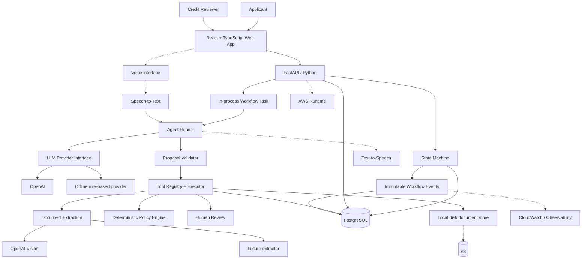

# System Architecture

Solid lines are built in Phase 1. Dashed components are planned for later phases and do
not exist yet.

## What changed from the original sketch

The first version of this diagram showed a `Node.js / TypeScript API`. The backend is
Python and FastAPI — see `00-handoff.md` section 7, which settled that before any code
was written. Two further differences are worth naming, because they are decisions rather
than drift:

- **The agent does not reach the database.** It proposes an action, the validator checks
  it against the tool registry, and only then does a tool execute. Nothing in the agent
  path writes directly.
- **Both AI components sit behind interfaces with a working offline implementation.**
  The default configuration runs the entire workflow with no API key and no network.
  Neither offline implementation is a language model, and neither pretends to be one.

`03-voice-latency.md` never referenced Node and is unchanged.
