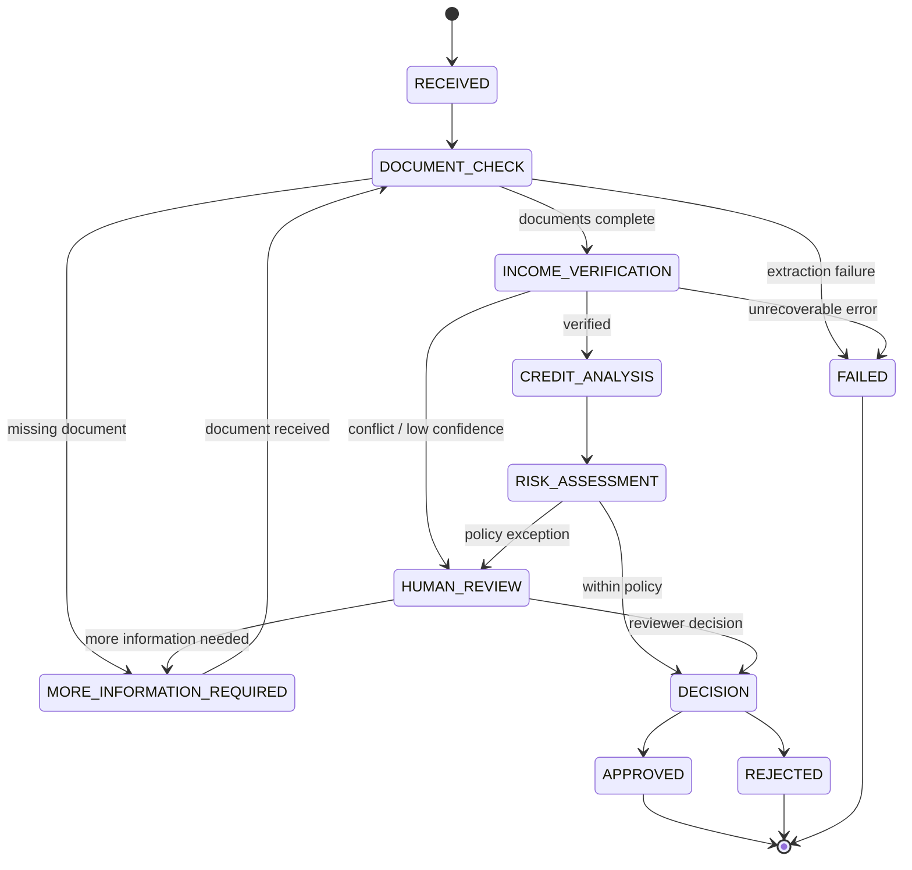
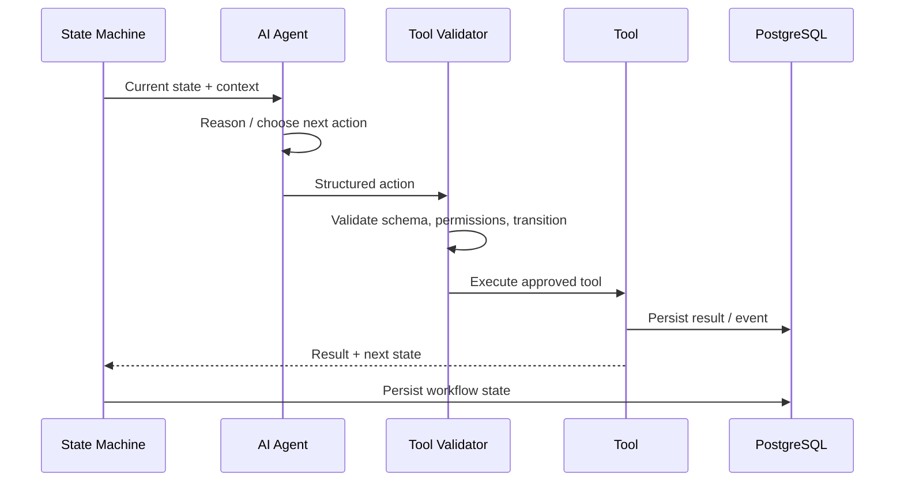

# Agent + State Machine

```mermaid
stateDiagram-v2
    [*] --> RECEIVED
    RECEIVED --> DOCUMENT_CHECK

    DOCUMENT_CHECK --> INCOME_VERIFICATION: documents complete
    DOCUMENT_CHECK --> MORE_INFORMATION_REQUIRED: missing document
    DOCUMENT_CHECK --> FAILED: extraction failure

    MORE_INFORMATION_REQUIRED --> DOCUMENT_CHECK: document received

    INCOME_VERIFICATION --> CREDIT_ANALYSIS: verified
    INCOME_VERIFICATION --> HUMAN_REVIEW: conflict / low confidence
    INCOME_VERIFICATION --> FAILED: unrecoverable error

    CREDIT_ANALYSIS --> RISK_ASSESSMENT
    RISK_ASSESSMENT --> HUMAN_REVIEW: policy exception
    RISK_ASSESSMENT --> DECISION: within policy

    HUMAN_REVIEW --> DECISION: reviewer decision
    HUMAN_REVIEW --> MORE_INFORMATION_REQUIRED: more information needed

    DECISION --> APPROVED
    DECISION --> REJECTED

    APPROVED --> [*]
    REJECTED --> [*]
    FAILED --> [*]
```

## Agent execution boundary

```mermaid
sequenceDiagram
    participant WF as State Machine
    participant A as AI Agent
    participant V as Tool Validator
    participant T as Tool
    participant DB as PostgreSQL

    WF->>A: Current state + context
    A->>A: Reason / choose next action
    A->>V: Structured action
    V->>V: Validate schema, permissions, transition
    V->>T: Execute approved tool
    T->>DB: Persist result / event
    T-->>WF: Result + next state
    WF->>DB: Persist workflow state
```
