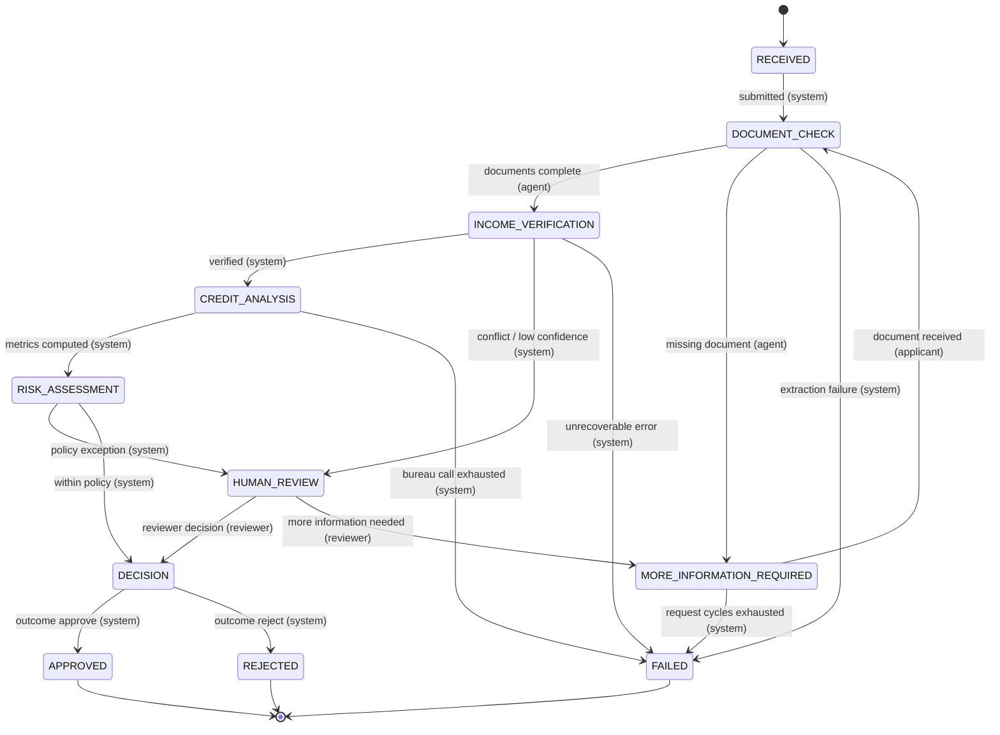
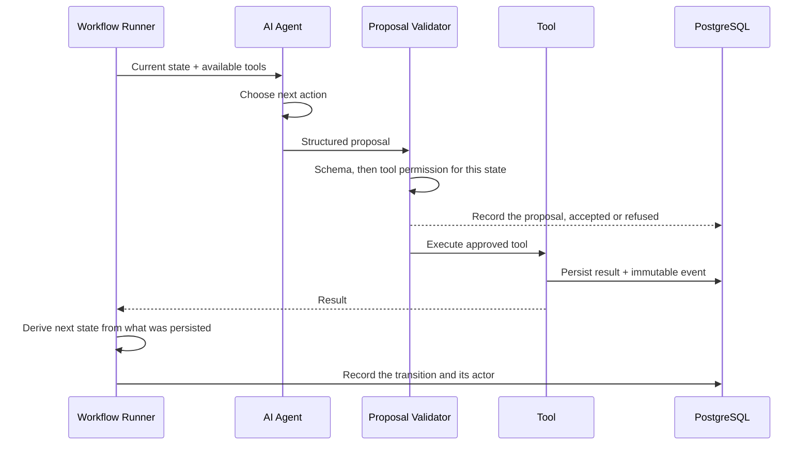

# Agent + State Machine

The authoritative table lives in `apps/api/src/vero/state_machine/transitions.py` as
data, and `apps/api/tests/test_transitions.py` transcribes it independently from this
document so that drift in either direction fails a test.

Each edge names the one actor permitted to drive it. That is what keeps the agent away
from decisions: `DECISION -> APPROVED` is owned by the system, so no model output can
reach it.

## Two edges added since the first draft

Both close gaps in the original sketch that spec section 12 requires:

- **`MORE_INFORMATION_REQUIRED -> FAILED`** bounds the resubmission loop. Without it an
  applicant who never supplies a document keeps a workflow alive forever. The count is a
  round trip to the applicant, incremented by the runner when it pauses, not by the tool
  that sends the message — counting tool calls made this edge unreachable, because the
  runner paused before the agent could ask again.
- **`CREDIT_ANALYSIS -> FAILED`** covers the one genuinely external call in Phase 1.

## Edges deliberately not added

`RISK_ASSESSMENT` and `DECISION` have no `FAILED` edge. Both are pure deterministic
arithmetic; the only model involvement is the human-readable narrative, and a narrative
that fails to generate degrades to a template rather than losing a decision. Adding
`FAILED` there would imply the risk maths can fail when it cannot.

`RECEIVED -> FAILED` is absent because intake validation is a 422 — a rejected
application is never created.

## Agent execution boundary

The agent never names a target state: the proposal schema has no field for one. The
runner derives the next state by reading what the tools actually recorded, so a
transition follows from persisted facts rather than from what the model asserted.
