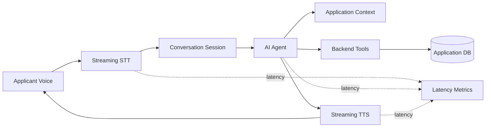
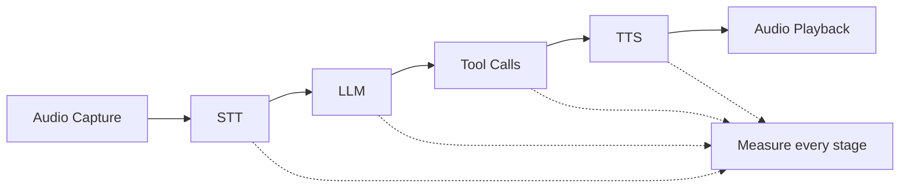

# Voice Agent Architecture

```mermaid
flowchart LR
    USER[Applicant Voice] --> STT[Streaming STT]
    STT --> SESSION[Conversation Session]
    SESSION --> AGENT[AI Agent]
    AGENT --> CACHE[Application Context]
    AGENT --> TOOLS[Backend Tools]
    TOOLS --> DB[(Application DB)]
    AGENT --> TTS[Streaming TTS]
    TTS --> USER

    STT -. latency .-> METRICS[Latency Metrics]
    AGENT -. latency .-> METRICS
    TTS -. latency .-> METRICS
```

## Latency budget

```mermaid
flowchart LR
    A[Audio Capture] --> B[STT]
    B --> C[LLM]
    C --> D[Tool Calls]
    D --> E[TTS]
    E --> F[Audio Playback]

    B -.-> M[Measure every stage]
    C -.-> M
    D -.-> M
    E -.-> M
```

The project should record actual p50/p95 latency for each stage rather than hard-code performance claims.
