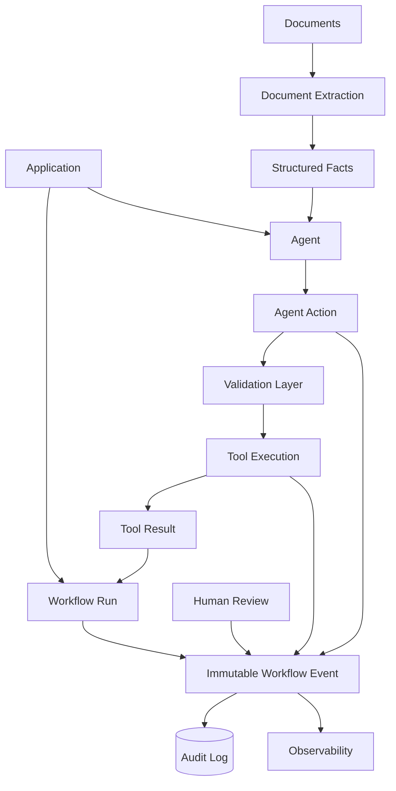

# Data + Audit Flow

```mermaid
flowchart TB
    APP[Application] --> WF[Workflow Run]
    DOC[Documents] --> EXTRACT[Document Extraction]
    EXTRACT --> FACTS[Structured Facts]

    FACTS --> AGENT[Agent]
    APP --> AGENT

    AGENT --> ACTION[Agent Action]
    ACTION --> VALIDATE[Validation Layer]
    VALIDATE --> TOOL[Tool Execution]

    TOOL --> RESULT[Tool Result]
    RESULT --> WF

    WF --> EVENT[Immutable Workflow Event]
    ACTION --> EVENT
    TOOL --> EVENT
    REVIEW[Human Review] --> EVENT

    EVENT --> AUDIT[(Audit Log)]
    EVENT --> OBS[Observability]
```

Every important state transition, agent action, tool execution, and human decision should be traceable to an application and workflow run.
